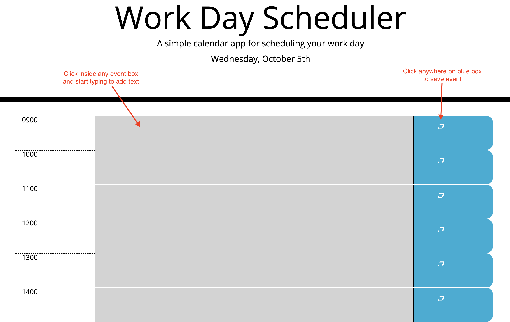

# challenge-5
Workday Planner

<!-- link github and deployed application -->
#### __[Deployed Application](https://mthomsn.github.io/challenge-5/)__ 
#### __[GitHub Repository](https://github.com/mthomsn/challenge-5)__

## Tools
- HTML
- Bootstrap
- Javascript
- JQuery
- CSS
- Moment

<!-- description -->
## Description
The purpose of this challenge was to practicing storing information in local storage using Javascript. Using the provided starter code I used Bootstrap to create the time blocks, and then I created the Javascript logic to display current date with Moment, and save user event text in local storage.

<!-- deployed and usage + screenshots -->
## Deployed
[Deployed Application](https://mthomsn.github.io/challenge-5/) 

 

<!-- what i learned -->
## What I learned
I learned how to call a third party API, Moment, and I learned how to store information into the local storage using Javascript. 

<!-- credits -->
## Credits
Thanks to the University of Texas and instructor Leah Nelson for providing challenge and starter code.
All HTML and CSS was provided by University of Texas.

<!-- contact me -->
## Contact Me
Email: [matthewthomsen99@gmail.com](mailto:matthewthomsen99@gmail.com?) 
Github: [mthomsn](https://github.com/mthomsn)